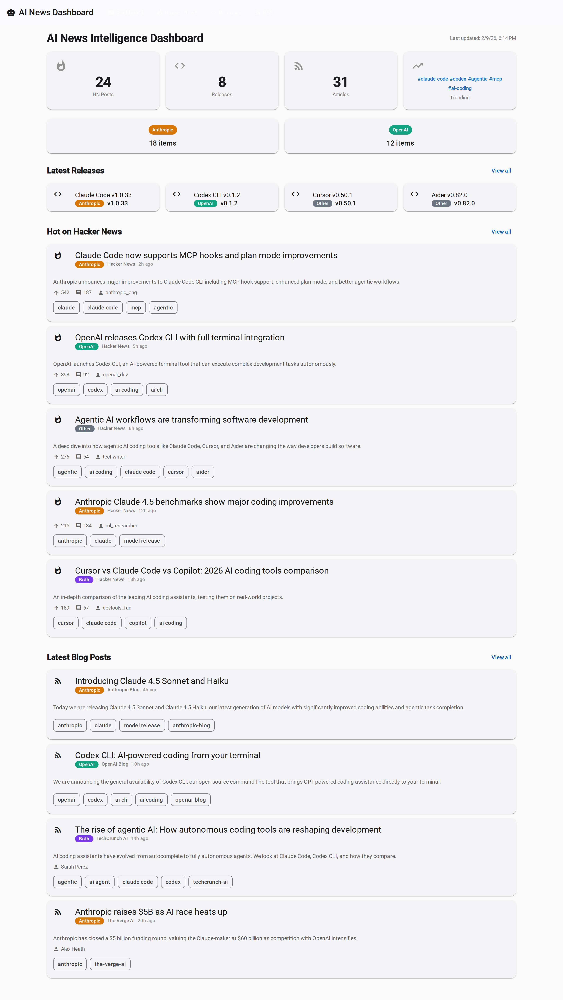
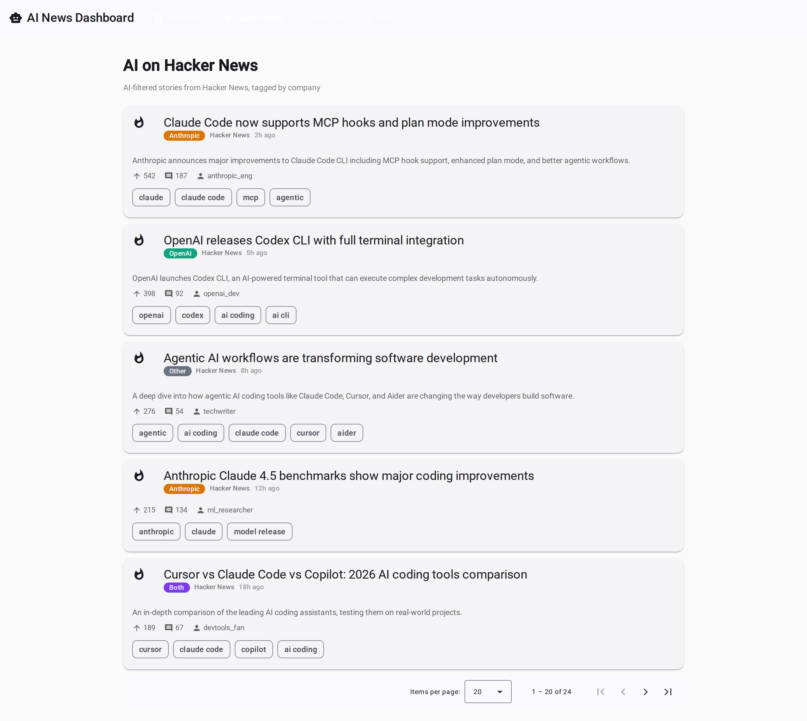
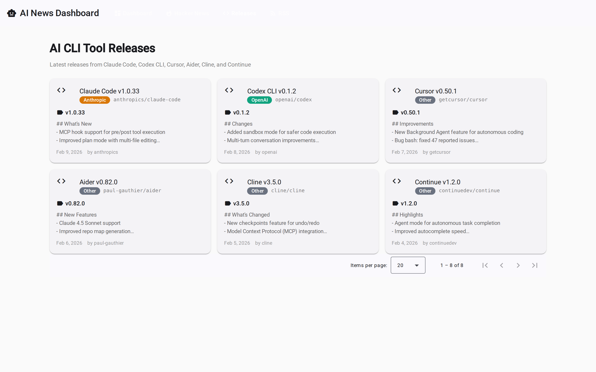
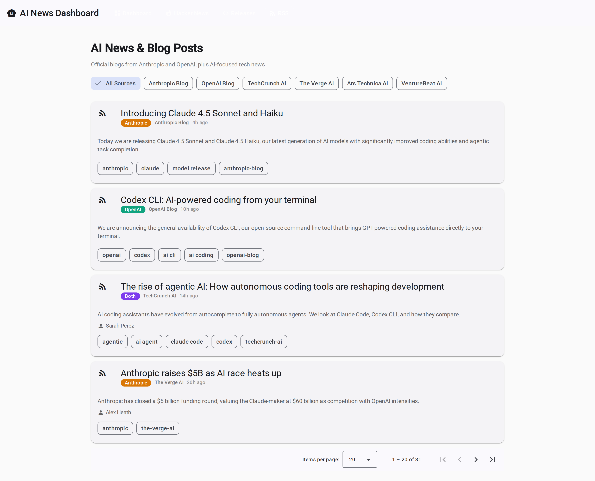
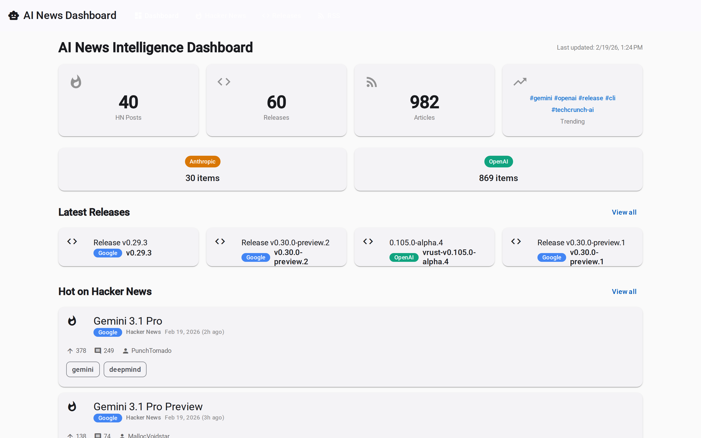

# AI News Intelligence Dashboard

A real-time dashboard tracking AI news from Anthropic, OpenAI, Google Gemini, and popular AI CLI tools. Aggregates content from Hacker News, GitHub Releases, and RSS feeds — all from free, public data sources with no API keys required.

**Live site:** [fchchen.github.io/news-dashboard](https://fchchen.github.io/news-dashboard/)

## Screenshots

| Dashboard | Hacker News |
|---|---|
|  |  |

| GitHub Releases | RSS Feeds |
|---|---|
|  |  |

| Google Gemini News |
|---|
|  |

## Data Sources

### Hacker News
Top 500 stories filtered by AI keywords (claude, openai, gemini, chatgpt, copilot, llm, agentic, etc.) via the Firebase API.

### GitHub Releases
Tracked repositories:
- [anthropics/claude-code](https://github.com/anthropics/claude-code)
- [openai/codex](https://github.com/openai/codex)
- [getcursor/cursor](https://github.com/getcursor/cursor)
- [paul-gauthier/aider](https://github.com/paul-gauthier/aider)
- [cline/cline](https://github.com/cline/cline)
- [continuedev/continue](https://github.com/continuedev/continue)
- [google-gemini/gemini-cli](https://github.com/google-gemini/gemini-cli)

### RSS Feeds
- Anthropic News (scraped from anthropic.com/news)
- OpenAI News
- Google AI Blog (DeepMind)
- TechCrunch AI
- The Verge AI
- Ars Technica AI
- VentureBeat AI

## Tech Stack

- **Backend:** .NET 8 Minimal API with in-memory storage
- **Frontend:** Angular 21, Angular Material, standalone components, signals
- **Deployment:** GitHub Pages with static data capture
- **CI/CD:** GitHub Actions

## How It Works

The site is deployed to GitHub Pages as a static site. A GitHub Actions workflow runs every hour (8 AM–10 PM Eastern):

1. Starts the .NET API in the background
2. Scrapes Anthropic's news page (no RSS available) to generate a local feed
3. Waits for the API to fetch data from all sources
4. Captures API responses as static JSON files
5. Builds the Angular app pointing at the JSON files
6. Deploys to GitHub Pages

The Angular frontend uses client-side pagination over the cached JSON data.

## Local Development

```bash
# Run the API
dotnet run --project src/Api/NewsDashboard.Api.csproj

# Run the frontend (in another terminal)
cd frontend && npm start
```

The frontend dev server proxies `/api` requests to the .NET API at `localhost:5000`.

## Project Structure

```
src/Api/          .NET 8 Minimal API (endpoints, services, background fetcher)
src/Shared/       Shared models, DTOs, constants (AI keywords, feed sources)
frontend/         Angular 21 app with Material Design
scripts/          Static data capture script
.github/workflows GitHub Actions deployment workflow
```
